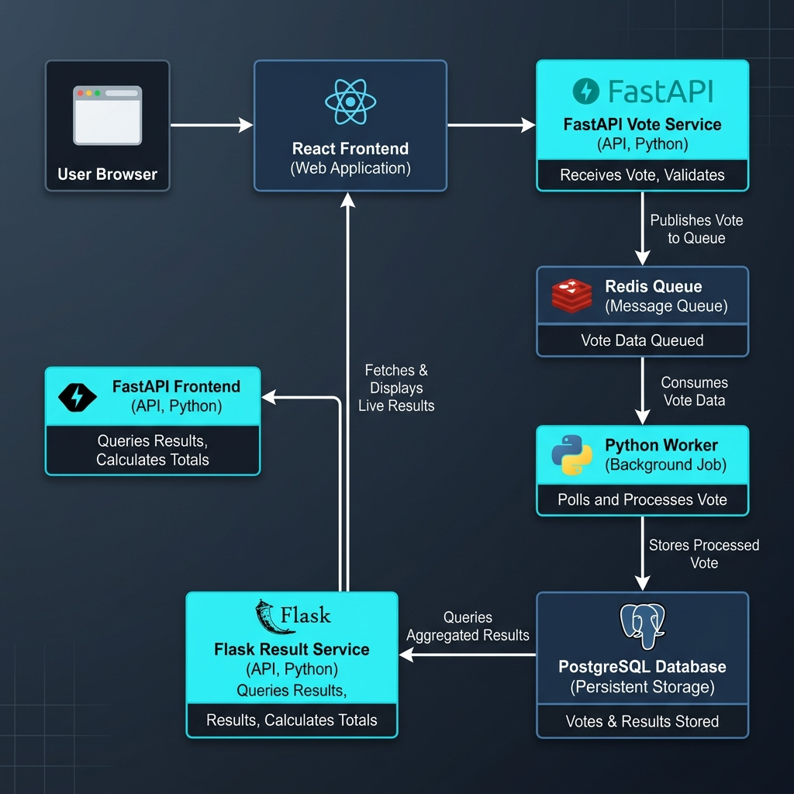
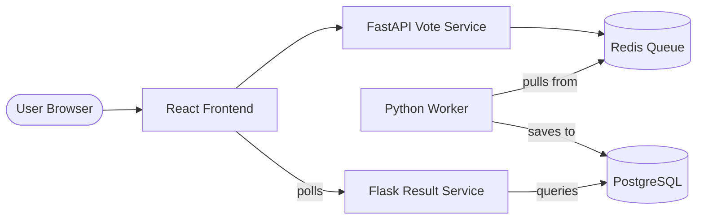

# Advanced DevOps Assignment: The Ultimate Vote

## Scenario
You have been hired as a DevOps Engineer for a high-stake voting platform. The development team has provided you with the source code for 4 microservices. Your task is to containerize this entire architecture and automate the deployment using the skills you've learned: **Linux, Git, and Docker**.

### **System Workflow**

## Architecture Overview
The system consists of the following components:
1.  **Frontend (React/Vite)**: A web interface where users can cast votes and see live results.
2.  **Vote Service (FastAPI)**: Receives votes and pushes them to a Redis queue.
3.  **Worker (Python)**: A background service that pulls votes from Redis and saves them into a PostgreSQL database.
4.  **Result Service (Flask)**: Fetches aggregated counts from the database and serves them to the frontend.

## Requirements
To complete this assignment, you must:

### 1. Dockerization
- Create a `Dockerfile` for each of the 4 services.
- Optimize the images (use small base images like `python:3.9-slim` or `node:alpine`).
- Ensure environment variables are used for connection strings (Redis host, DB host, etc.).

### 2. Orchestration
- Create a `docker-compose.yml` file to run the entire stack.
- Include the following external services:
    - **PostgreSQL**: For persistent data storage.
    - **Redis**: For the message queue.
- Use **Docker Volumes** to ensure database data is persisted even if the containers are removed.
- Use **Docker Networks** to isolate services properly.

### 3. Automation (Bash)
- Create a bash script named `deploy.sh` that:
    1. Checks if Docker and Docker-Compose are installed.
    2. Builds the images.
    3. Starts the services in detached mode.
    4. Prints the status of the containers.

### 4. Version Control (Git)
- Initialize a git repository.
- Create a `.gitignore` file to exclude `__pycache__`, `node_modules`, and `.env` files.
- Document your progress with meaningful commit messages.

## Environment Variables Needed
- `REDIS_HOST`: The name of your Redis container.
- `DB_HOST`: The name of your PostgreSQL container.
- `DB_NAME`, `DB_USER`, `DB_PASS`: Database credentials.
- `VITE_VOTE_API`: URL for the Vote API (Frontend needs this).
- `VITE_RESULT_API`: URL for the Result API (Frontend needs this).

## Success Criteria
- [ ] Accessible React UI on `http://localhost:3000`.
- [ ] Submitting a vote "Team Python" or "Team JavaScript" updates the results after a few seconds.
- [ ] No hardcoded IPs in the source code (everything should use container names).
- [ ] Data is not lost when running `docker-compose down`.

---
**Good luck, Engineer!**
